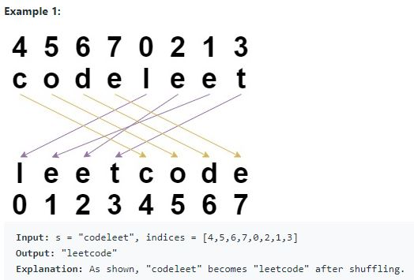

# King 🎮
Shuffle String

# Summary 🤔
# Shuffle String
* Leetcode exercise: https://leetcode.com/problems/shuffle-string/

1- Given a string s and an integer array indices of the same length.

2- The string s will be shuffled such that the character at the ith position moves to indices[i] in the shuffled string.

3- Return the shuffled string.

## Example:

